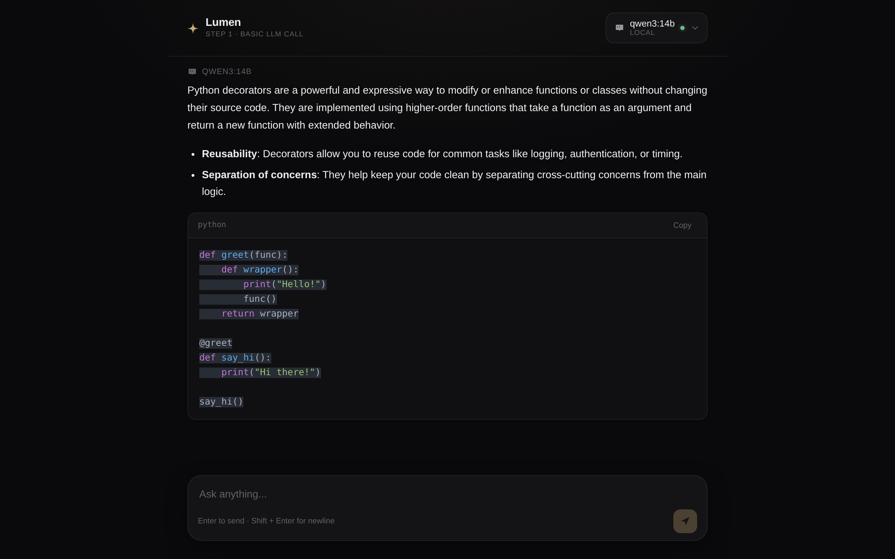

# ai-agent-lab

A small project for learning how AI agents actually work, from the ground up — starting with the simplest possible thing an "agent" needs: calling an LLM and getting a response back.

No frameworks doing the thinking for you. No black boxes. Just plain Python and React, built one concept at a time.

The chat UI that comes with it has its own name — **Lumen** — but the repo itself is the actual point: it's the record of the learning, not the product.



## Where this is at

The learning plan looks like this:

1. **Basic LLM call** ← currently here
2. Basic agent
3. Tool calling
4. Multiple tools
5. Agent loop
6. Memory
7. RAG
8. Planning
9. Multi-step agent
10. Multi-agent system

Step 1 is deliberately the simplest possible thing — send a question, get an answer, no loop, no memory, no tools. But "simplest possible thing" turned into a real testbed once I started asking questions like *what does it take to swap models*, *what does streaming actually look like over the wire*, and *how do you render Markdown from a model without either trusting it blindly or building a parser yourself*. So Step 1 ended up growing into:

- a small backend that can talk to **five** different LLM providers behind one identical interface
- real token-by-token streaming over Server-Sent Events, not a fake typing animation
- a chat UI that renders Markdown, code (with real syntax highlighting), tables, and LaTeX properly — because half of what a model says back is code, and rendering it as a wall of plain text defeats the point

None of that changes what Step 1 *is*. It's still one LLM call per message, no memory between turns, no tools. It just got a proper front door.

## What it actually does

- Pick any configured model — Claude, a local Ollama model, GPT, Gemini, or Groq — from one dropdown, and ask it something
- Watch the answer stream in token by token
- Get back real formatting: headings, lists, tables, blockquotes, inline and block code with syntax highlighting and a copy button, LaTeX math
- Copy or regenerate any response
- If a provider isn't configured (no API key), it shows up in the picker as unavailable with the actual reason — it doesn't just silently fail when you pick it

## Providers

| Provider | Where it runs | Env var | Default model |
|---|---|---|---|
| Claude | Cloud (Anthropic) | `ANTHROPIC_API_KEY` | `claude-opus-5` |
| OpenAI | Cloud | `OPENAI_API_KEY` | `gpt-4o-mini` |
| Gemini | Cloud (Google) | `GEMINI_API_KEY` | `gemini-flash-latest` |
| Groq | Cloud (fast inference) | `GROQ_API_KEY` | `openai/gpt-oss-20b` |
| Ollama | Local, on your machine | none — just run `ollama serve` | whatever you've pulled |

Every cloud provider's model is overridable with an env var (`OPENAI_MODEL`, `GEMINI_MODEL`, `GROQ_MODEL`) without touching code — model IDs drift over time, so the default is a reasonable starting point, not gospel. Ollama doesn't need a default at all: it asks the local server what's actually installed and lists exactly that.

You don't need all five keys. Whatever you haven't configured just shows up disabled in the picker instead of breaking anything.

## How it's built

The interesting part isn't the UI, it's the shape of the backend. Adding OpenAI, Gemini, and Groq didn't touch the request-handling code at all — that's the whole point of how it's structured:

```
React UI
   │
   ▼
POST /api/ask/stream
   │
   ▼
Gateway (server.py)  ──  resolves "provider:model", asks the registry for it
   │
   ▼
Provider Registry  ──  { "claude": ClaudeProvider(), "ollama": OllamaProvider(), ... }
   │
   ▼
ClaudeProvider / OllamaProvider / OpenAIProvider / GeminiProvider / GroqProvider
   │
   ▼
streaming.py  ──  normalizes whatever the provider yields into one SSE format:
                   start → delta → delta → ... → done  (or → error)
```

Every provider implements the same four-method interface (`ai/llm/base.py`): `is_available()`, `list_models()`, `stream()`. The gateway calls those four methods and nothing else — it has no idea Claude's SDK looks nothing like Ollama's raw HTTP API, or that Gemini's client is shaped differently again. That's `streaming.py`'s job: turn whatever a provider produces into the same four SSE event types, every time, so the frontend never needs to know which provider answered.

Concretely, this is what adding Groq looked like: one new file (`ai/llm/groq.py`, ~40 lines) and one line in the registry. `server.py`, `streaming.py`, and the entire React app were untouched.

The frontend mirrors this — the model picker groups whatever the backend returns by provider and by `kind` (cloud/local), with zero hardcoded provider names. If a sixth provider shows up in `/api/models` tomorrow, it just appears.

## Stack

**Backend** — Python, [FastAPI](https://fastapi.tiangolo.com/) + [Uvicorn](https://www.uvicorn.org/), talking to each provider's official SDK (`anthropic`, `openai`, `google-genai`, `groq`) plus plain `requests` for Ollama.

**Frontend** — React 19 + [Vite](https://vite.dev/), [react-markdown](https://github.com/remarkjs/react-markdown) with `remark-gfm`/`remark-math`/`rehype-katex` for Markdown and LaTeX, [react-syntax-highlighter](https://github.com/react-syntax-highlighter/react-syntax-highlighter) (Prism, light build — only the languages actually needed) for code blocks. No state management library, no UI kit — it's small enough not to need one.

## Project structure

```
ai-agent-lab/
├── launch.py                     # starts backend + frontend together, frees their ports first
├── venv/                         # Python virtual environment
├── docs/
│   └── screenshot.png
├── ai/                            # everything about calling/serving an LLM - grows one concept at a time
│   ├── requirements.txt
│   ├── server.py                   # the gateway - the only file that knows HTTP exists
│   ├── streaming.py                # normalizes any provider's output into one SSE format
│   └── llm/                         # Step 1: Basic LLM call
│       ├── base.py                   # the LLMProvider interface every provider implements
│       ├── registry.py               # where a new provider gets wired in - one line
│       ├── claude.py
│       ├── ollama.py
│       ├── openai.py
│       ├── gemini.py
│       └── groq.py
└── frontend/
    └── src/
        ├── api/llm.js              # the only file that knows fetch()/SSE exist
        ├── hooks/
        │   ├── useChat.js            # message state, streaming, regenerate, cancellation
        │   ├── useModels.js          # fetches the model catalog
        │   └── useCopyFeedback.js
        └── components/
            ├── ModelSelector.jsx      # custom popover, groups by provider dynamically
            ├── ChatWindow.jsx
            ├── ChatMessage.jsx
            ├── MarkdownRenderer.jsx
            ├── CodeBlock.jsx
            ├── Composer.jsx
            └── EmptyState.jsx
```

`ai/` intentionally doesn't have `agents/`, `tools/`, `memory/`, or `rag/` directories yet — those get created when those steps actually get built, not before. Right now there's only one concept in here (`llm/`), and the structure should tell the truth about that.

## Getting started

You need Python 3.10+, Node 18+, and at least one working way to reach an LLM (a cloud API key, or a local [Ollama](https://ollama.com) install).

```bash
# backend
python3 -m venv venv
./venv/bin/pip install -r ai/requirements.txt

# frontend
cd frontend
npm install
cd ..
```

Set whichever API keys you actually have:

```bash
export ANTHROPIC_API_KEY=sk-ant-...
export OPENAI_API_KEY=sk-...
export GEMINI_API_KEY=...
export GROQ_API_KEY=gsk_...
```

None of these are required — skip the ones you don't have, and use a local Ollama model instead (`ollama serve`, then `ollama pull qwen3:14b` or whatever you'd like).

## Running it

Easiest way — one command, starts both, cleans up any leftover process on those ports first:

```bash
venv/bin/python launch.py
```

That's backend on `:5001`, frontend on `:5175`. Open the frontend URL and go.

Or run them separately if you want to see each one's logs on their own:

```bash
# terminal 1
cd ai
../venv/bin/python server.py

# terminal 2
cd frontend
npm run dev
```

## Notes to self

- The frontend's `VITE_API_BASE_URL` (in `frontend/.env`) points at the backend. Defaults to `localhost:5001`, only needs changing if the backend moves.
- Model IDs for the cloud providers (`gpt-4o-mini`, `gemini-flash-latest`, `openai/gpt-oss-20b`) are what was current when I built this. Providers retire and rename models constantly — if one starts 404ing, check the provider's current model list and set the matching `_MODEL` env var rather than editing the provider file.
- `ai/llm/*.py` are the only files that know a specific vendor's SDK exists. Everything else — the gateway, the streaming format, the entire frontend — only knows about the four-method interface. That boundary is the whole reason adding a provider stayed a one-file change instead of a rewrite each time.
